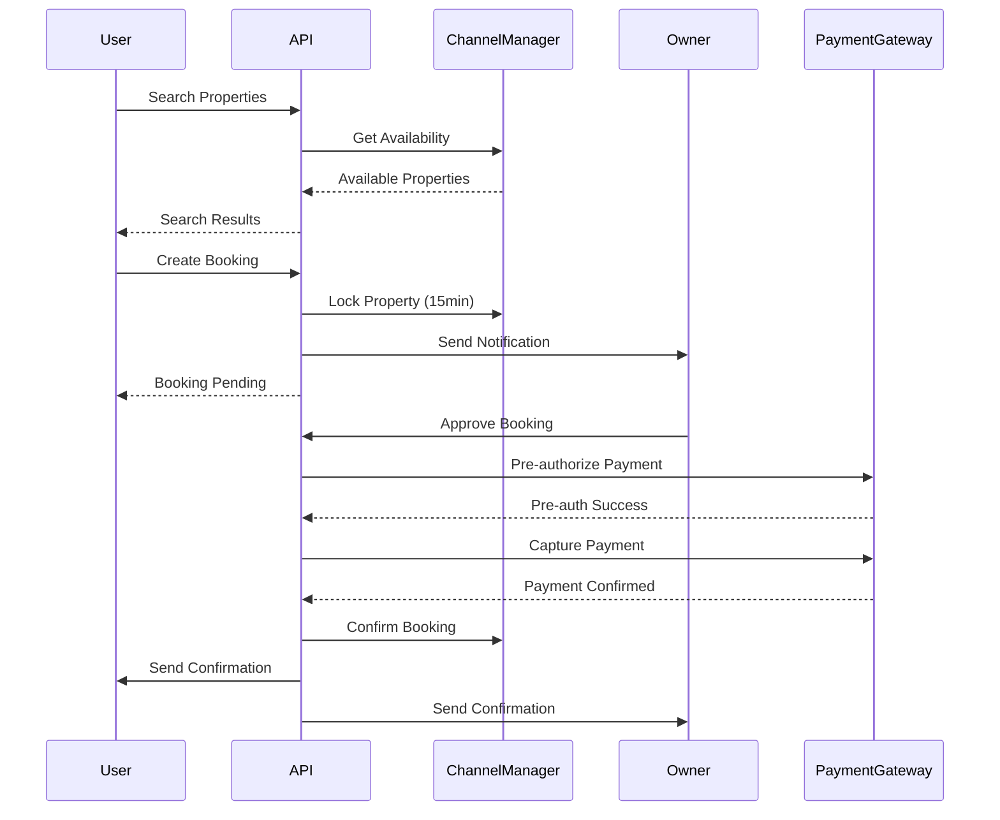

# Mishmish API 🏡

> A comprehensive property rental platform API with shift-based bookings, real-time notifications, and integrated payment processing.

[](https://nodejs.org/)
[](https://expressjs.com/)
[](https://www.postgresql.org/)
[](https://redis.io/)
[](https://docker.com/)
[](LICENSE)

## 🌟 Features

### 🔐 **Authentication & Security**

-   JWT-based authentication with secure token management
-   Rate limiting and CORS protection
-   Input validation and sanitization
-   Password hashing with bcrypt

### 🏠 **Property Management**

-   Integration with external Channel Manager API
-   Real-time availability checking
-   Property search with filters (location, dates, amenities)
-   Atomic property locking to prevent double-bookings

### 📅 **Shift-Based Booking System**

-   **Morning Shift**: 6:00 AM - 2:00 PM
-   **Evening Shift**: 2:00 PM - 10:00 PM
-   **Full Day**: 6:00 AM - 10:00 PM
-   Flexible pricing per shift or per day

### ⚡ **Real-Time Workflow**

-   15-minute owner approval window
-   Server-Sent Events for live status updates
-   Background job processing with Redis queues
-   Automatic timeout handling

### 💳 **Payment Processing**

-   APS Payment Gateway integration
-   Two-phase payment flow (pre-authorization → capture)
-   Payment failure handling and retry logic
-   Comprehensive transaction tracking

### 📱 **Multi-Channel Notifications**

-   **SMS** via Twilio
-   **WhatsApp** Business API
-   **Email** with custom templates
-   Real-time delivery status tracking

### 🔄 **Background Processing**

-   Redis-based job queues
-   Automatic reservation timeouts
-   Notification delivery with retries
-   Cleanup and maintenance tasks

## 🚀 Quick Start

### Prerequisites

-   **Node.js** 18+ and npm
-   **PostgreSQL** 15+ (via Supabase)
-   **Redis** 7+
-   **Docker** (optional but recommended)

### 🛠️ Installation

1. **Clone the repository**

```bash
git clone https://github.com/yourusername/mishmish-api.git
cd mishmish-api
```

2. **Install dependencies**

```bash
npm install
```

3. **Environment setup**

```bash
cp .env.example .env
```

Edit `.env` with your configuration values (see [Environment Variables](#environment-variables))

4. **Database setup**

```bash
npm run migrate
npm run seed
```

5. **Start the application**

```bash
# Development mode
npm run dev

# Production mode
npm start
```

6. **Verify installation**

```bash
curl http://localhost:3000/health
```

### 🐳 Docker Deployment

#### Development

```bash
docker-compose up -d
```

#### Production

```bash
docker-compose -f docker-compose.prod.yml up -d
```

## 📋 Environment Variables

Create a `.env` file with the following variables:

### Application Configuration

```env
NODE_ENV=development
PORT=3000
APP_URL=http://localhost:3000
JWT_SECRET=your-super-secret-jwt-key-make-it-long-and-random
```

### Database Configuration

```env
SUPABASE_URL=https://your-project.supabase.co
SUPABASE_SERVICE_ROLE_KEY=your-service-role-key
SUPABASE_ANON_KEY=your-anon-key
```

### Redis Configuration

```env
REDIS_URL=redis://localhost:6379
REDIS_HOST=localhost
REDIS_PORT=6379
```

### Channel Manager API

```env
CHANNEL_MANAGER_URL=http://localhost:3001/api
CHANNEL_MANAGER_API_KEY=your-channel-manager-api-key
```

### Payment Gateway (APS)

```env
APS_BASE_URL=https://api.aps.com
APS_MERCHANT_ID=your-merchant-id
APS_ACCESS_CODE=your-access-code
APS_SHA_REQUEST_PHRASE=your-sha-request-phrase
APS_SHA_RESPONSE_PHRASE=your-sha-response-phrase
```

### Notification Services

```env
# Email (SMTP)
SMTP_HOST=smtp.gmail.com
SMTP_PORT=587
SMTP_USER=your-email@gmail.com
SMTP_PASS=your-app-password
FROM_EMAIL=noreply@mishmish.com

# WhatsApp Business API
WHATSAPP_PHONE_NUMBER_ID=your-phone-number-id
WHATSAPP_ACCESS_TOKEN=your-whatsapp-access-token

# Twilio SMS
TWILIO_ACCOUNT_SID=your-twilio-account-sid
TWILIO_AUTH_TOKEN=your-twilio-auth-token
TWILIO_PHONE_NUMBER=+1234567890
```

### Security & Performance

```env
ALLOWED_ORIGINS=http://localhost:3000,https://yourdomain.com
RATE_LIMIT_WINDOW_MS=900000
RATE_LIMIT_MAX_REQUESTS=100
MAX_FILE_SIZE=10485760
```

## 📡 API Documentation

### Base URL

```
https://api.mishmish.com/api/v1
```

### Authentication

All endpoints (except auth) require a JWT token:

```
Authorization: Bearer <your-jwt-token>
```

### Core Endpoints

#### 🔐 Authentication

```http
POST /auth/register     # Register new user
POST /auth/login        # User login
POST /auth/refresh      # Refresh token
```

#### 🏠 Properties

```http
GET  /properties/search            # Search available properties
GET  /properties/:id               # Get property details
POST /properties/:id/availability  # Check specific availability
```

#### 📅 Reservations

```http
POST   /reservations                        # Create booking
GET    /reservations                        # Get user bookings
GET    /reservations/:id                    # Get booking details
PATCH  /reservations/:id/owner-response     # Owner approve/reject
PATCH  /reservations/:id/cancel             # Cancel booking
```

#### 👤 User Management

```http
GET    /users/profile              # Get user profile
PATCH  /users/profile              # Update profile
POST   /users/profile/image        # Upload profile image
GET    /users/favorites            # Get favorite properties
POST   /users/favorites            # Add to favorites
DELETE /users/favorites/:id        # Remove from favorites
```

#### 💳 Payments

```http
GET /payments          # Get payment history
GET /payments/:id      # Get payment details
```

#### 🔔 Notifications

```http
GET   /notifications           # Get user notifications
PATCH /notifications/:id/read  # Mark as read
```

#### ⚡ Real-Time Updates

```http
GET /events/reservation/:id    # SSE stream for booking updates
GET /events/notifications      # SSE stream for user notifications
```

### 📊 Response Format

#### Success Response

```json
{
	"message": "Operation successful",
	"data": {
		// Response data
	},
	"pagination": {
		// For paginated endpoints
		"page": 1,
		"limit": 20,
		"total": 100,
		"total_pages": 5
	}
}
```

#### Error Response

```json
{
	"error": "Error message",
	"details": "Additional error details",
	"code": "ERROR_CODE"
}
```

## 🔄 Booking Workflow

The complete booking process follows this sequence:



### Booking States

-   **Pending**: Awaiting owner response (15-minute window)
-   **Approved**: Owner approved, processing payment
-   **Paid**: Payment captured, booking confirmed
-   **Rejected**: Owner declined booking
-   **Expired**: Owner didn't respond within 15 minutes
-   **Failed**: Payment or system error
-   **Cancelled**: User cancelled booking

## 🧪 Testing

### Run Tests

```bash
# All tests
npm test

# Watch mode
npm run test:watch

# Coverage report
npm run test:coverage

# Integration tests only
npm run test:integration

# Performance tests
npm run test:performance
```

### Test Coverage

The project maintains 80%+ test coverage across:

-   Unit tests for all services
-   Integration tests for complete workflows
-   Performance tests for load handling
-   Authentication and authorization tests

### Sample Test Data

```javascript
// Create test user
const testUser = {
	name: "John Doe",
	email: "john@example.com",
	phone_number: "+1234567890",
	password: "password123",
}

// Create test booking
const testBooking = {
	property_id: 123,
	shift_id: 1,
	start_date: "2025-07-15T06:00:00Z",
	end_date: "2025-07-15T14:00:00Z",
}
```

## 🏗️ Architecture

### System Overview

```
┌─────────────────┐     ┌─────────────────┐    ┌─────────────────┐
│   Mobile App    │     │   Web Frontend  │    │  Owner Portal   │
└─────────┬───────┘     └─────────┬───────┘    └─────────┬───────┘
          │                       │                      │
          └───────────────────────┼──────────────────────┘
                                  │
                    ┌─────────────▼─────────────┐
                    │      Mishmish API         │
                    │   (Node.js/Express)       │
                    └─────────────┬─────────────┘
                                  │
        ┌─────────────────────────┼─────────────────────────┐
        │                         │                         │
        ▼                         ▼                         ▼
┌─────────────┐          ┌─────────────────┐         ┌─────────────────┐
│  Supabase   │          │ Channel Manager │         │ External APIs   │
│ PostgreSQL  │          │      API        │         │ • APS Payment   │
│             │          │ • Properties    │         │ • SMS Gateway   │
│ • Users     │          │ • Availability  │         │ • WhatsApp API  │
│ • Bookings  │          │ • Locking       │         │ • Email Service │
│ • Payments  │          │ • Pricing       │         │                 │
└─────────────┘          └─────────────────┘         └─────────────────┘
       │                          │                           │
       ▼                          ▼                           ▼
┌─────────────┐          ┌─────────────────┐         ┌─────────────────┐
│    Redis    │          │   File Storage  │         │   Monitoring    │
│             │          │   (Supabase)    │         │                 │
│ • Sessions  │          │ • Property Imgs │         │ • Logs          │
│ • Job Queue │          │ • Documents     │         │ • Metrics       │
│ • Cache     │          │ • User Photos   │         │ • Alerts        │
└─────────────┘          └─────────────────┘         └─────────────────┘
```

### Service Responsibilities

#### Mishmish API (Our Backend)

-   User authentication and management
-   Reservation workflow orchestration
-   Payment processing coordination
-   Notification delivery
-   Business logic enforcement
-   Data persistence and caching

#### Channel Manager (External)

-   Property listings and details
-   Real-time availability management
-   Property locking/unlocking
-   Pricing information
-   Search and filtering

#### External Services

-   **APS Payment Gateway**: Payment processing
-   **Twilio**: SMS notifications
-   **WhatsApp Business API**: WhatsApp messaging
-   **SMTP**: Email delivery
-   **Supabase Storage**: File storage

### Technology Stack

| Component          | Technology          | Purpose                      |
| ------------------ | ------------------- | ---------------------------- |
| **Runtime**        | Node.js 18+         | JavaScript runtime           |
| **Framework**      | Express.js          | Web application framework    |
| **Database**       | Supabase PostgreSQL | Data persistence             |
| **Cache**          | Redis               | Caching and job queues       |
| **Authentication** | JWT                 | Stateless authentication     |
| **Queue**          | Bull (Redis)        | Background job processing    |
| **Testing**        | Jest + Supertest    | Unit and integration testing |
| **Documentation**  | JSDoc + Markdown    | API documentation            |
| **Deployment**     | Docker              | Containerization             |
| **Monitoring**     | Winston + Morgan    | Logging and monitoring       |

## 🚀 Deployment

### Production Deployment Checklist

#### Pre-deployment

-   [ ] Environment variables configured
-   [ ] Database migrations run
-   [ ] SSL certificates installed
-   [ ] Load balancer configured
-   [ ] Monitoring setup
-   [ ] Backup strategy implemented

#### Cloud Deployment Options

##### AWS

```bash
# ECS with Application Load Balancer
docker build -t mishmish-api .
docker tag mishmish-api:latest your-account.dkr.ecr.region.amazonaws.com/mishmish-api:latest
docker push your-account.dkr.ecr.region.amazonaws.com/mishmish-api:latest
```

##### Google Cloud Platform

```bash
# Cloud Run deployment
gcloud builds submit --tag gcr.io/your-project/mishmish-api
gcloud run deploy --image gcr.io/your-project/mishmish-api --platform managed
```

##### Azure

```bash
# Container Instances
az container create --resource-group myResourceGroup --name mishmish-api --image mishmish-api:latest
```

### Load Balancer Configuration

The included `nginx.conf` provides:

-   Load balancing across multiple API instances
-   Rate limiting (10 requests/second)
-   SSL termination
-   Health check routing
-   Security headers

### Scaling Guidelines

#### Horizontal Scaling

-   **API Servers**: Scale based on CPU usage (target: 70%)
-   **Background Workers**: Scale based on queue length
-   **Database**: Use read replicas for read-heavy workloads

#### Performance Optimization

-   **Redis Caching**: Cache frequently accessed data
-   **Database Indexing**: Optimize queries with proper indexes
-   **CDN**: Use CDN for static assets
-   **Connection Pooling**: Configure database connection limits

## 📊 Monitoring & Observability

### Health Checks

```bash
# Application health
curl http://localhost:3000/health

# Database connectivity
curl http://localhost:3000/health/db

# Redis connectivity
curl http://localhost:3000/health/redis
```

### Logging

The application uses structured logging with Winston:

-   **Error logs**: `logs/error.log`
-   **Combined logs**: `logs/combined.log`
-   **Console output**: Development mode only

### Metrics to Monitor

-   **API Response Times**: < 200ms average
-   **Queue Processing**: < 30 seconds per job
-   **Database Connections**: < 80% of pool
-   **Error Rate**: < 1% of total requests
-   **Memory Usage**: < 80% of available

### Alerting

Set up alerts for:

-   High error rates (> 5%)
-   Slow response times (> 1 second)
-   Queue backlog (> 100 jobs)
-   Database connection failures
-   Payment gateway errors

## 🔧 Configuration

### Database Configuration

```javascript
// Supabase connection settings
const supabaseConfig = {
	url: process.env.SUPABASE_URL,
	key: process.env.SUPABASE_SERVICE_ROLE_KEY,
	auth: {
		autoRefreshToken: false,
		persistSession: false,
	},
}
```

### Redis Configuration

```javascript
// Redis connection with retry strategy
const redisConfig = {
	url: process.env.REDIS_URL,
	retry_strategy: (options) => {
		if (options.error && options.error.code === "ECONNREFUSED") {
			return new Error("Redis server connection refused")
		}
		return Math.min(options.attempt * 100, 3000)
	},
}
```

### Job Queue Configuration

```javascript
// Bull queue settings
const queueConfig = {
	defaultJobOptions: {
		removeOnComplete: 10,
		removeOnFail: 5,
		attempts: 3,
		backoff: {
			type: "exponential",
			delay: 2000,
		},
	},
}
```

## 🤝 Contributing

### Development Setup

1. Fork the repository
2. Create a feature branch: `git checkout -b feature/amazing-feature`
3. Install dependencies: `npm install`
4. Make your changes
5. Add tests for new features
6. Run tests: `npm test`
7. Commit changes: `git commit -m 'Add amazing feature'`
8. Push to branch: `git push origin feature/amazing-feature`
9. Open a Pull Request

### Code Standards

-   **ESLint**: Follow Airbnb JavaScript style guide
-   **Testing**: Maintain 80%+ test coverage
-   **Documentation**: Update README and API docs
-   **Commits**: Use conventional commit messages

### Pull Request Process

1. Update documentation for any API changes
2. Add tests for new functionality
3. Ensure all tests pass
4. Update version numbers if applicable
5. Request review from maintainers

## 📝 License

This project is licensed under the MIT License - see the [LICENSE](LICENSE) file for details.

## 🆘 Support

### Documentation

-   **API Documentation**: `/docs` endpoint when running
-   **Database Schema**: `src/database/migrations/`
-   **Examples**: `tests/` directory

### Common Issues

#### Database Connection Issues

```bash
# Check Supabase URL and keys
echo $SUPABASE_URL
echo $SUPABASE_SERVICE_ROLE_KEY

# Test connection
npm run migrate
```

#### Redis Connection Issues

```bash
# Check Redis connectivity
redis-cli ping

# Verify Redis URL
echo $REDIS_URL
```

#### Payment Gateway Issues

```bash
# Verify APS credentials
echo $APS_MERCHANT_ID
echo $APS_ACCESS_CODE

# Check test transactions
curl -X POST http://localhost:3000/api/v1/payments/test
```

### Getting Help

-   **GitHub Issues**: Report bugs and feature requests
-   **Discussions**: Ask questions and get help
-   **Email**: contact@mishmish.com for enterprise support

## 🎯 Roadmap

### Version 1.1 (Q3 2025)

-   [ ] Advanced search filters
-   [ ] Bulk booking operations
-   [ ] Analytics dashboard
-   [ ] Mobile push notifications

### Version 1.2 (Q4 2025)

-   [ ] Multi-language support
-   [ ] Advanced pricing rules
-   [ ] Booking templates
-   [ ] API rate limiting tiers

### Version 2.0 (Q1 2026)

-   [ ] GraphQL API
-   [ ] Microservices architecture
-   [ ] Advanced analytics
-   [ ] Machine learning recommendations

---

## 🏆 Acknowledgments

-   **Express.js** team for the excellent web framework
-   **Supabase** for providing PostgreSQL as a service
-   **Redis** team for the powerful caching solution
-   **APS** for payment gateway services
-   All contributors and maintainers

---

**Built with ❤️ by the Mishmish Team**

_Ready to revolutionize property rentals! 🚀_
